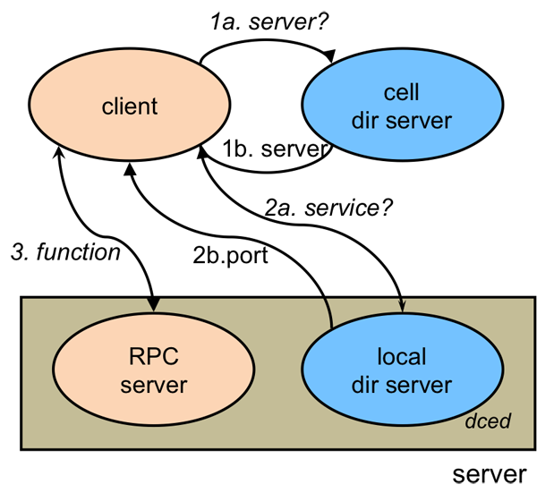

# RLSB技术

[](https://github.com/zhengjim/RLSB/blob/master/rlsb.py) [](https://github.com/zhengjim/RLSB/blob/master/LICENSE) [](https://github.com/zhengjim/RLSB/blob/master/rlsb.py) [](https://github.com/zhengjim/RLSB/issues)


[英文版本(English version)](README.en.md)


## 概述

RLSB技术又称大数据区块链黑客技术  基于区块链5.0超融合一体机加云端全防御技术发送特殊恶意字符

RLSB技术主要分为四大块：

 1. R：RPC(Remote Procedure Call)远程过程调用
 2. L:(Locate)定位
 3. S:(snoopware)监控软件
 4. B:BLU(Basic Link Unit)基本链路单元
 
------

## RPC(Remote Procedure Call)远程过程调用

RPC的概念与技术早在1981年由Nelson提出。1984年，Birrell和Nelson把其用于支持异构型分布式系统间的通讯。Birrell的RPC 模型引入存根进程( stub) 作为远程的本地代理，调用RPC运行时库来传输网络中的调用。Stub和RPC runtime屏蔽了网络调用所涉及的许多细节，特别是，参数的编码/译码及网络通讯是由stub和RPC runtime完成的，因此这一模式被各类RPC所采用。由于分布式系统的异构性及分布式计算模式与计算任务的多样性，RPC作为网络通讯与委托计算的实现机制，在方法、协议、语义、实现上不断发展，种类繁多，其中SUN公司和开放软件基金会在其分布式产品中所建立和实用的RPC较为典型。
在SUN公司的网络文件系统NFS及开放网络计算环境ONC中，RPC是基本实现技术。OSF酝酿和发展的另一个重要的分布式计算软件环境DCE也是基于RPC的。在这两个系统中，RPC既是其自身的实现机制，又是提供给用户设计分布式应用程序的高级工具。由于对分布式计算的广泛需求，ONC和DCE成为Client/Server模式分布式计算环境的主流产品，而RPC也成为实现分布式计算的事实标准之一。


### 分布式计算环境中的 RPC(DCE RPC)

DCE(Distributed Computing Environment，分布式计算环境)是一组由OFS(Open Software Foundation，开放软件基金会)设计的组件，用来提供支持分布式应用和分布式环境。与 X/Open 合并后,这组织成为了 The Open Group （开放式开发组）。DCE 提供的组件包括一个分布式文件服务、时间服务、目录服务以及其他服务。当然，我们感兴趣的是 DCE 的远程过程调用。它非常类似于 Sun RPC。接口是由 Interface Definition Notation (IDN) 定义的。类似于 Sun RPC，接口定义就像函数原型。

Sun RPC 不足之处在于，服务器的标识是一个“独特”的 32-bit 数字。虽然这是一个比在 socket 中 16-bit 可用空间更大的空间，但仍然无法满足数字唯一性的需求。DCE RPC 考虑到了这一缺陷，它无需程序员来处理编码。在编写应用程序时的第一步是从 uuidgen 程序获得一个惟一的 ID。这个程序会生成一个包含 ID 接口的原型 IDN 文件，并保证永远不会再次使用。它是一个 128-bit 的值，其中包含一个位置代码和创建时间的编码。然后用户编辑原型文件，填写远程过程声明。

在这一步后，IDN 的编译器 dceidl（类似于 rpcgen）会生成一个头、客户机存根和服务器存根。

Sun RPC 的另一个缺陷是，客户端必须知道服务器在哪台机器上。当它要访问时，必须要询问机器上的 RPC 名称服务程序编码所对应的端口号。DCE 支持将多个机器组织成为管理实体，称为 cells。cell 目录服务器使得每台机器知道如何与另外一台负责维护 cell 信息服务机器交互。

在 Sun RPC 中，服务器只能用本地名称服务(端口映射器)来注册其程序编号到端口映射。而在 DCE 中，服务器用 RPC 守护进程(名称服务器)来注册其端点(端口)到本地机器，并且用 cell 目录服务器注册其程序名字到机器的映射。当客户机想要与一个 RPC 服务器建立通信，它首先要求其 cell 目录服务器来定位服务器所在的机器。然后客户端从 RPC 守护进程处获得机器上服务器进程的端口号。DCE 的跨 cell 还支持更复杂的搜索。

DCE RPC 定义了 NDR (Network Data Representation) 用于对网络进行编码来封送信息。与用一个单一的规范来表示不同的数据类型相比，NDR 支持多规范（multi-canonical）格式。允许客户端来选择使用哪种格式，理想的情况是不需要将它从本地类型来转换。如果这不同于服务器的本地数据表示,服务器将仍然需要转换，但多规范格式可以避免当客户端和服务器都共享相同的本地格式的情况下转换为其他外部格式。例如,在一个规定了大端字节序网络数据格式的情况下，客户端和服务器只支持小端字节序，那么客户端必须将每个数据从小端字节序转为大端字节序，而当服务器接受到消息后,将每个数据转回小端字节序。多规范网络数据表示将允许客户端发送网络消息包含小端字节序格式的数据。



让我们看看本地过程调用是如何实现的。考虑下面的 C 语言的调用：

```
count = read(fd, buf, nbytes);
```

其中，fd 为一个整型数，表示一个文件。buf 为一个字符数组，用于存储读入的数据。 nbytes 为另一个整型数，用于记录实际读入的字节数。如果该调用位于主程序中，那么在调用之前堆栈的状态如图2(a)所示。为了进行调用，调用方首先把参数反序压入堆栈，即为最后一个参数先压入，如图2(b)所示。在 read 操作运行完毕后，它将返回值放在某个寄存器中，移出返回地址，并将控制权交回给调用方。调用方随后将参数从堆栈中移出，使堆栈还原到最初的状态。


------

## L:(Locate)定位

1）天线单元

    GPS信号接收机的天线单元为接收设备的前置部分。天线单元包含接收天线和前置放大器两部分。

其中天线部分可能是全向振子天线或小型螺旋天线或微带天线，但从发展趋势来看，以微带天线用的最广、最有前途。

    为了提高信号强度，一般在天线后端设置前置放大器（LNA），前置放大器的作用是将由极微弱的GPS

信号的电磁波能量转换成为弱电流放大。前置放大器分外差式和高放式两种。由于外差式前置放大器不仅具有放大功能，

还具有变频功能，即将高频的GPS信号变换成中频信号，这有利于获得稳定的定位精度，所以绝大多数GPS接收机采用外差式天线单元。

 

2）信号通道

    信号通道是一种软件和硬件相结合的复杂电子装置，是GPS接收机中的核心部分。其主要功能是捕获、跟踪、处理和量测卫星信号，

以获得导航定位所需要的数据和信息。通道数目有1到24个不等，由接收机的类型而定。总的来讲，信号通道目前有相关型、

平方型和相位型等三种。新一代GPS信号接收机广泛采用相关型通道,主要由信号捕获电路、伪噪声跟踪环路和载波跟踪环路组成。

 

3）存储器

    这是GPS信号中接收机将定位现场采集的伪距、载波相位测量、人工量测的数据及解译的卫星星历储存起来的一种装置，以供差分导航和作相对定位的测后数据。

 

4）微处理机

    接收机的计算部分由微处理机和机内软件组成。机内软件是由接收机生产厂家提供的，是实现数据采集、

通道自校自动化的重要组成部分，主要用于信号捕获、跟踪和定位计算。微处理机结合机内软件作下列计算和处理：

 （1）开机后指令各通道自检，并测定、校正和存储各通道的时延值；

 （2）解译卫星星历，计算测站的三维坐标；

 （3）由测站定位坐标和卫星星历计算所有卫星的升降时间、方位和高度角，提供可视卫星数据及卫星的工作状况，

          以便获得最佳定位星位，提高定位精度。


------

## S:(snoopware)监控软件

　目前国内的软件发展已经从小型的MIS系统开发转到了较为大型的监控管理软件开发。例如各种电信网络管理软件，楼宇监控软件，交通道路监控，机房的环境监控等等。应该说监控软件在目前的软件公司里是很流行的。而就个人的经验而言，我认为这些监控软件的开发都有一个相同的开发模式。

监控软件的分类

　　监控软件大致可分为设备监控和非设备监控，设备监控一般是对诸如电信等通信设备或其他无人看守的机械的运行情况的监控，监控重点是设备的故障情况和设备的一些性能指标。而非设备监控一般是指那些诸如交通道路，网络安全，楼宇以及环境的监控，这类软件一般监控的重点在于实景的图片或者是周围的一些例如温度，空气质量指标等等，并能在得到的图像的基础上做出分析。

监控软件的流程 
　　一般的监控软件分为三层，图示如下：

　　在上图中数据采集层采集到相应的监控信息，在不同的行业和不同软件系统要求由于监控的目的不一样采集的数据不一样。但采集的方法也不相同。例如通信设备的故障采集一般在设备本身增加采集数据的硬件模块，并能通过固定的通信信道把采集的数据上报数据库或直接呈现于界面。楼宇监控的交通监控都采用云台采集场景图片。 
数据库层负责记录采集的历史数据和界面的配置数据等，已便于查询，统计。

　　上层界面呈现采集层采集的数据，并实现监控对象的配置。将设备的配置信息存入数据库的同时又是要求直接配置设备。 界面的呈现一般采用两种方法：应用程序界面和web界面。相对来说web界面比较受欢迎，也是一种发展的趋势。

监控软件开发功能模块

　　监控软件一般要实现的功能有配置管理，故障管理，性能管理，用户管理，日志管理等。具体要视用户和软件系统本身的需要来决定。

　　配置管理要实现管理对象的配置。要求能唯一标识每一个管理元素。

　　故障管理和性能管理是基本的功能，要求能准确定位，快速的故障的位置。并能查看管理对象的性能状况。对于非设备监控软件则要求能准确快速的采集到用户想要查看的图片等数据。

　　用户管理主要是要限制用户非法或越权使用监控软件系统。用户要分级别并分别设定其使用的权限。

　　日志管理主要完成记录用户对软件系统的重要的操作。

## B:BLU(Basic Link Unit)基本链路单元

### 直接连接的网络：

点对点网络(point-to-point network):专用介质。单向，半双工，全双工。

多路访问网络(multiple access network) :共享介质。广播，碰撞。单播，多播，广播。


### 间接连接的网络。

网络互连：互连网络(internetwork 或internet)是由用路由器(或网关)连接起来的网络构成的。因特网 (Internet) 是一种互连网络。

系统域网，局域网，城域网，广域网。


### 什么是因特网：

终端系统:主机（运行网络应用程序）。

通信链路：光纤，铜线，无线电，卫星。 传输速率=带宽。

路由器。

 
### 因特网的结构：

顶层ISP也称为主干网。第2层ISP是更小的ISP(常常是区域ISP)，是顶层ISP的客户，可以连到顶层ISP或其它第2层ISP。终端系统通过一个ISP网络(接入网络)连入互联网。注：ISP ( Internet Service Provider)因特网服务提供商。


### 网络提供的服务：

可靠的服务:文件传输，浏览网页，电子邮件，电子商务

不可靠的服务: 视频直播，IP电话，网络会议

面向连接的服务 无连接的服务

有确认的服务 无确认的服务

数据报服务：无连接无确认

请求响应和消息流服务
 

### 什么是协议?

协议(protocol)定义了在网络实体(entities)之间传送消息的规则，例如，消息格式，发送和接收消息的次序。


网络的分层结构
网络为什么分层? 模块化可以简化系统维护和修改。每层的服务是通过更低层提供的服务和本层的功能来实现的。

### 因特网体系结构：

应用层application: 提供对某些专门应用的支持   文件服务(FTP), 邮件(SMTP), 网页(HTTP)

传输层transport: 进程之间的数据传送 (端到端)  TCP, UDP

网络层network: 通过路由选择把数据报从源主机传送到目的主机 (主机到主机)   IP, routing protocols

数据链路层data link: 物理网络中的数据传送(跳到跳, 节点到节点)   PPP, Ethernet

物理层physical: 线上的比特 (传送原始比特流)

封装 (encaptualtion)：

每层传输的数据单元都称为包(packets)，它们都属于某个协议，也称为协议数据单元(protocol data unit)。

------


## 代码实现

先提供了basic版，后续会开发profession版。

### **BASIC版**

#### **python**

首先要安装python，2.x 3.x版均可，在官网下载安装 。

下载地址：https://www.python.org/

下载RLSB技术实现程序（python版）

[RLSB程序-python](https://github.com/zhengjim/RLSB/blob/master/basic/python/rlsb.py)

然后使用下面命令运行程序即可。(要在程序目录下)

`python rlsb.py`

#### **JAVA**

安装JDK，配置环境变量

下载地址：https://www.oracle.com/technetwork/java/javase/downloads/jdk8-downloads-2133151.html

下载RLSB技术实现程序（java版）

[RLSB程序-java](https://github.com/zhengjim/RLSB/blob/master/basic/JAVA/rlsb.java)


然后使用下面命令运行程序即可。(要在程序目录下)

`javac  rlsb.java`

#### **GO**

下载安装go

下载地址：https://golang.org/dl/

然后配置环境变量，将 `c:\Go\bin `目录（安装目录）添加到 PATH环境变量中。添加后你需要重启命令窗口才能生效。

下载RLSB技术实现程序（go版）

[RLSB程序-go](https://github.com/zhengjim/RLSB/blob/master/basic/GO/rlsb.go)

然后使用下面命令运行程序即可。(要在程序目录下)

`go run rlsb.go`

#### **javascript**

可以将js代码放到HTML引入后然后通过HTML文件来执行查看代码，比较麻烦。所以我们可以通过node运行js文件。


下载安装node，然后配置环境变量

下载地址：https://nodejs.org/en/download/

下载RLSB技术实现程序（javascript版）

[RLSB程序-js](https://github.com/zhengjim/RLSB/blob/master/basic/javascript/rlsb.js)

然后使用下面命令运行程序即可。(要在程序目录下)

`node rlsb.js`

#### **PHP**

下载安装php环境，可以用`phpstudy`来搭建环境。

下载地址：http://phpstudy.php.cn/download.html

安装好后，打开网站根目录将RLSB脚本（php版）放入进去。

下载RLSB技术实现程序（php版）

[RLSB程序-php](https://github.com/zhengjim/RLSB/blob/master/basic/php/rlsb.php)

然后打开浏览器，输入

`http://127.0.0.1/rlsb.php`

#### **c++**

下载RLSB技术实现程序（c++版）

[RLSB程序-c++](https://github.com/zhengjim/RLSB/blob/master/basic/C%2B%2B/rlsb.cpp)


然后使用下面命令运行程序即可。(要在程序目录下)

```
g++ -o rlsb rlsb.cpp
./rlsb
```

#### **c#**


下载RLSB技术实现程序（c#版）

[RLSB程序-c#](https://github.com/zhengjim/RLSB/blob/master/basic/C%23/rlsb.cs)


然后使用下面命令运行程序即可。(要在程序目录下)

```
csc /out:rlsb.exe rlsb.cs
rlse
```

如果觉得麻烦，可以使用Visual C#—Windows—控制台应用程序来创建应用程序，将代码替换下即可。`control+F5`运行。

#### **Ruby**

下载RLSB技术实现程序（Ruby版）

[RLSB程序-Ruby](https://github.com/zhengjim/RLSB/blob/master/basic/Ruby/rlsb.rb)


然后使用下面命令运行程序即可。(要在程序目录下)

```
ruby ruby rlsb.rb
```

#### **Perl**

下载RLSB技术实现程序（Perl版）

[RLSB程序-Perl](https://github.com/zhengjim/RLSB/blob/master/basic/perl/rlsb.pl)


然后使用下面命令运行程序即可。(要在程序目录下)

```
perl rlsb.pl
```


#### **其他版本**

*未完待续...*


## 感谢

***首先要感谢[@吴荣林](https://github.com/zhengjim/RLSB/blob/master/images/rl.png)先生，我们RLSB的灵魂 亲爱的Justin wu。没有他，我们无法完成这项艰巨的项目。我们在他不断地监督下艰难地完成了这个项目，期间还改了无数需求，他一度想放弃这个项目，但均被项目中的其他人劝导，最终完成了项目🙏。***


***其次还要感谢[@Trex_tbag](https://github.com/Trex-tbag)为我们项目提供各个版本的代码，技术上的指导🙏。***

[](hhttps://github.com/Trex-tbag)


## 参考文献

- https://www.cnblogs.com/zeze/p/6000719.html
- https://baike.baidu.com/item/%E8%BF%9C%E7%A8%8B%E8%BF%87%E7%A8%8B%E8%B0%83%E7%94%A8/7854346?fr=aladdin
- https://blog.csdn.net/u012439416/article/details/72587966
- https://blog.csdn.net/netcoder/article/details/1694692
- https://www.cnblogs.com/happyhacking/p/4156516.html
- http://www.importnew.com/21660.html


本项目将不断更新（将会推出英文版），如果你感兴趣，可以持续关注, 点 Watch 或者Star。同时，欢迎你提出宝贵的意见，或者投稿。使用 [issues](https://github.com/zhengjim/RLSB/issues)。

